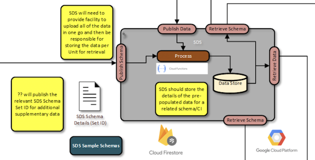

# Background

This is the repo for the Supplementary Data Service (SDS), which is described in the following pages:

* https://confluence.ons.gov.uk/display/SDC/Pre-Population+Solution+Architecture
* https://confluence.ons.gov.uk/pages/viewpage.action?spaceKey=SDC&title=Pre-Population+Data+Architecture
* https://confluence.ons.gov.uk/display/SDC/Provisioning+supplementary+datasets+to+the+SDC+platform

At the time of writing, what is stored here should be considered a prototype and hasn't been endorsed as a 
concrete implementation.

# Running locally

To run this prototype locally, you will need the following:

* Python 3.11
* A Google Firebase key file (see https://www.youtube.com/watch?v=MU7O6emzAc0)

To run, set up a local virtual environment and install the libraries described in the requirements file.

```bash
python venv .venv
. .venv/bin/activate
pip install -r requirement.txt
```

Copy the firebase key file to `firebase_key.json` (in this directory) and run the `run.sh` file in (in the virtual
environment).

# OpenAPI Specification

As this runs in FastAPI, the Open API Spec and interactive API docs are auto-generated from the Python code and
can be reached by going to the following URLs (once running):

* http://localhost:8000/openapi.json
* http://localhost:8000/docs


# How to use

## Publish Data

Data is published by the SDX as "sets" or "data sets". An example of a data set file can be found in 
[data_set.json](integration_tests/data/data_set.json).  This data is then "posted" to the SDS `/data_set`
endpoint as a JSON HTTP body. The following is returned:

```json
{
  "data_set_id": "ee677cde-863c-4fb6-ac0b-b99be2b1307c"
}
```

The returned "data_set_id" is then associated by the SDX with a survey and period. Internally the data_set is broken
down into units with each unit being stored as a retrievable document within the database.

## Retrieve Data

To retrieve the data, the user (EQ Runner) will need to supply the `unit_id` and `data_set_id`. The `data_set_id`
is set by the SDS when the SDX publishes the data set and the `unit_id` is set by the component which generates 
the data set (assumed to be the SDX). The following example demonstrates how you would call the "Retrieve Data" endpoint
`/unit_data`

* http://localhost:8000/unit_data?data_set_id=ee677cde-863c-4fb6-ac0b-b99be2b1307c&unit_id=55e64129-6acd-438b-a23a-3cf9524ab912 

## Publish Schema files

Schema files are published by another component. An example of a schema file can be found in 
[schema.json](integration_tests/data/schema.json).  This data is then "posted" to the SDS `/schema`
endpoint as a JSON HTTP body. The following is returned:

```json
{
  "schema_id": "e287698a-be82-4cc3-91ca-921883ade6fd"
}
```

## Retrieve Schema files

To retrieve the schema file, the user (EQ Author) will need to supply the `schema_id`. 
The following example demonstrates how you would call the "Retrieve Schema" endpoint `/schema`.

* http://localhost:8000/schema?schema_id=e287698a-be82-4cc3-91ca-921883ade6fd
