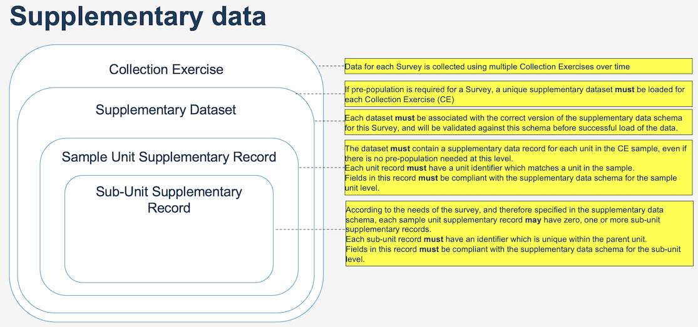

# Overview

This folder contains examples of pre-population data and corresponding schemas. The test_validation.py script should 
allow one to validate the other.

# Diagrams from DataModel Guidance Powerpoint

